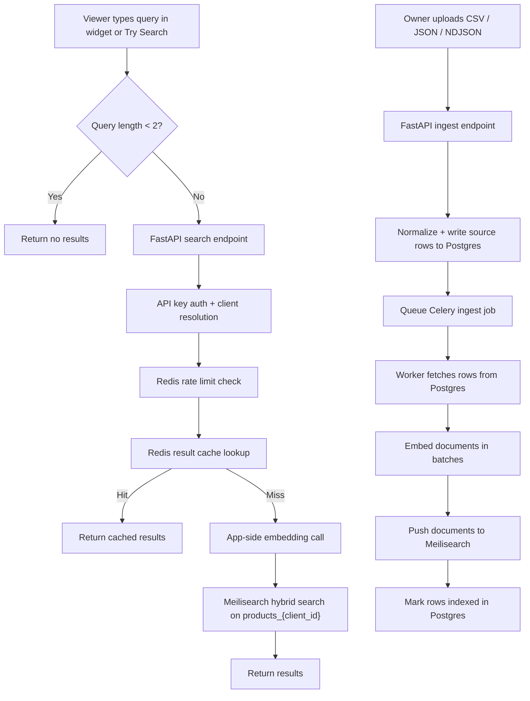
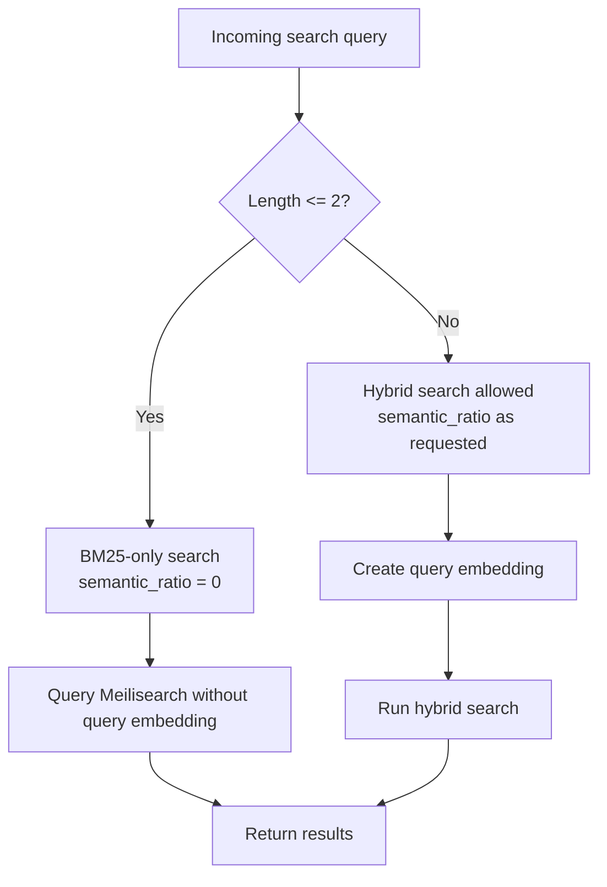
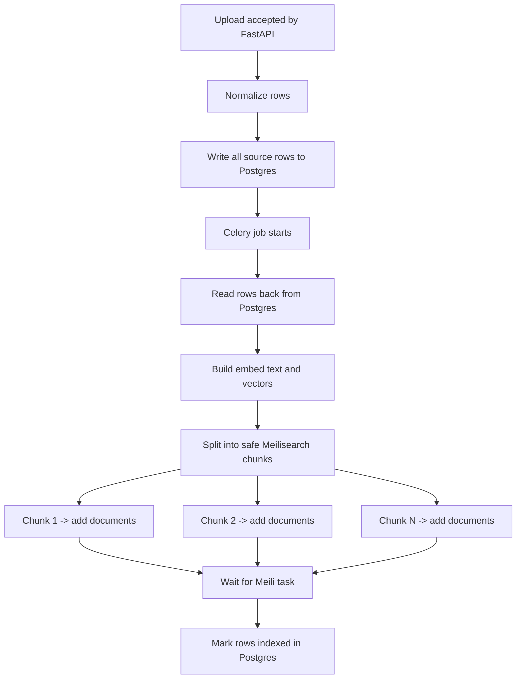

# Search and Indexing Resilience Plan

Status: planning note
Updated: 2026-05-04

This note covers the next round of search and indexing hardening for ScubaSearch.
It is intentionally focused on the current architecture:

- one VPS
- one Meilisearch instance
- one index per client
- PostgreSQL as source of truth
- Redis for cache and queue
- app-side embeddings

It does not propose per-client Meilisearch instances or custom sharding.

## Why we are doing this

ScubaSearch has two different pressure points:

1. Search concurrency
2. Large indexing payloads

Search pressure is mainly created by many users typing at once, especially when a lot of queries are uncached and semantic search is triggered too early.

Indexing pressure is mainly created by large upload batches that consume too much Meilisearch RAM, hit payload limits, or stress file descriptor limits during indexing.

## Current architecture



## Search behavior right now

Current live behavior:

- if `semantic_ratio > 0`, the app still creates a query embedding even for very short queries
- the old 3-character threshold idea was discussed, but it is not active in the current code

### Current behavior



### Why the threshold was considered

- cuts unnecessary query embedding calls
- reduces OpenAI or Azure OpenAI pressure during live typing
- keeps 1-2 character prefixes from paying the semantic cost too early
- improves concurrent search behavior without changing the product model

## Planned indexing behavior

We will keep the current product UX:

- user uploads one file
- ScubaSearch handles the safe batching internally

### Rule

- keep full source rows in Postgres first
- send Meilisearch smaller internal batches
- batch by estimated payload size and document count together

### Intended behavior



### Why this helps

- avoids asking the customer to split files
- reduces risk around the default 100 MB HTTP payload limit
- reduces RAM spikes during indexing
- keeps indexing recoverable because Postgres remains the canonical catalog

## Meilisearch constraints that matter

Confirmed from the official docs:

- default HTTP payload limit is 100 MB
- indexing can use up to two thirds of available RAM by default
- Meilisearch may hit internal errors on very large batches because of file descriptor limits
- primary key values must stay under 511 bytes
- Meilisearch supports up to 1000 concurrent search requests in its search queue by default
- sharding and replication require Meilisearch Enterprise Edition

References:

- https://www.meilisearch.com/docs/resources/help/known_limitations
- https://www.meilisearch.com/docs/resources/internals/documents
- https://www.meilisearch.com/docs/resources/self_hosting/performance/ram_multithreading
- https://www.meilisearch.com/docs/resources/self_hosting/configuration/reference
- https://www.meilisearch.com/docs/resources/self_hosting/sharding/overview

## Why we are not doing custom sharding now

We are intentionally not building our own sharding layer right now.

Reasons:

- the current bottleneck is more likely query embedding load and indexing pressure, not index size
- custom fan-out and result merge logic would add a lot of complexity around ranking, pagination, and failure handling
- distributed writes make replace / append / update / delete workflows much harder
- Meilisearch already supports one instance with many client indexes in Community Edition
- official Meilisearch sharding exists only in Enterprise Edition, so reproducing it ourselves would be expensive engineering work at the wrong time

## Search vs indexing on the same VPS

Search and indexing already use separate application paths, but they still share machine resources.

### Search path

- widget or dashboard request hits FastAPI
- FastAPI checks cache and rate limits
- uncached semantic searches call the embedding provider
- FastAPI sends a search request to Meilisearch

### Indexing path

- upload or sync queues a Celery job
- Celery reads source rows from Postgres
- worker embeds documents
- worker sends indexing tasks to Meilisearch

### Important nuance

They do not use different Meilisearch ports.

Both live search and document indexing talk to the same Meilisearch instance on the same VPS. The separation is logical:

- FastAPI handles user-facing searches
- Celery handles background indexing

The risk is not port collision. The risk is shared CPU, RAM, and Meilisearch indexing pressure.

## Runtime guardrails we should apply

### Production settings (Phase 7 VPS deploy — systemd service files)

These are environment variables consumed by Meilisearch directly (not by our Python app).
They go in the Meilisearch systemd service `[Service]` section or `/etc/environment`.

```ini
# /etc/systemd/system/meilisearch.service  [Service] section
Environment="MEILI_MAX_INDEXING_MEMORY=2147483648"   # 2 GB — caps indexing RAM (default: 2/3 of total RAM = 5.3 GB on 8 GB VPS; too high)
Environment="MEILI_HTTP_PAYLOAD_SIZE_LIMIT=104857600" # 100 MB — makes the default explicit; raise only if needed
LimitNOFILE=65536                                      # file descriptor limit (Meilisearch opens many files during indexing)
```

Meilisearch search queue: default 1000 concurrent search requests. Sufficient for launch.
No config change needed here. The main near-term levers remain batching, worker tuning, and result caching.

```ini
# /etc/systemd/system/uvicorn.service  [Service] section
ExecStart=... uvicorn main:app --host 0.0.0.0 --port 8000 --workers 2
# 2 workers: leaves 2+ GB RAM for Meilisearch indexing bursts; scale to 4 at 300+ clients
```

```ini
# /etc/systemd/system/celery.service  [Service] section
ExecStart=... celery -A workers.celery_app worker --concurrency=2 --loglevel=info
# 2 concurrent Celery tasks: each embeds 100 docs/call (OpenAI) then pushes ≤200 docs to Meilisearch
# Keeps indexing RAM usage bounded during concurrent uploads
```

RAM budget with these settings on the 8 GB VPS:

| Service         | Allocation       |
|-----------------|-----------------|
| Meilisearch     | up to 2 GB indexing + ~0.5 GB base |
| Celery (×2)     | ~300 MB         |
| uvicorn (×2)    | ~300 MB         |
| Postgres        | ~512 MB         |
| Redis           | ~200 MB         |
| OS headroom     | ~1 GB           |
| **Total**       | **~4.8 GB used, 3.2 GB free** |

### Search policy

- current code path: all queries still use semantic / hybrid when `semantic_ratio > 0`
- keep frontend debounce at 100ms (already set in widget.js)

### Indexing policy (implemented — code)

- ✅ app-side safe chunking: `_meili_safe_chunks()` in tasks.py — splits by `_MEILI_BATCH_DOCS=200` and `_MEILI_MAX_BATCH_BYTES=10MB`
- ✅ `_push_to_meili()` / `_update_in_meili()` helpers used in all 7 ingest call sites
- ✅ Postgres-first ingestion (unchanged)

## Azure OpenAI note

If we switch from OpenAI to Azure OpenAI embeddings for better India latency, this plan still holds.

Why:

- Meilisearch still receives user-provided vectors
- the semantic threshold logic stays in our app
- batching logic stays in our app
- the only thing that changes is the embedding provider behind the app-side embedding service

So this resilience plan is provider-agnostic as long as embeddings stay app-side.

## Implementation order

1. ✅ Safe batching — `workers/tasks.py`: `_EMBED_BATCH=100` (OpenAI), `_MEILI_BATCH_DOCS=200` (Meilisearch RAM), `_MEILI_BYTES_PER_DOC=15_000`, `_MEILI_MAX_BATCH_BYTES=10MB`, `_MEILI_BATCH_TIMEOUT_MS=120_000`; `_meili_safe_chunks()` dual-limit chunker; `_push_to_meili()` + `_update_in_meili()` helpers wrap all 7 Meilisearch push call sites; DB/API sync timeout raised 30s → 120s; `hybrid_search()` accepts `vector: list[float] | None`
2. ✅ Production runtime settings documented (VPS deploy — Phase 7):
   - `MEILI_MAX_INDEXING_MEMORY=2147483648` (2GB, ~25% of 8GB RAM)
   - `MEILI_HTTP_PAYLOAD_SIZE_LIMIT=104857600` (100MB default, explicit)
   - uvicorn `--workers 2` (conservative for 8GB VPS)
   - Celery `--concurrency=2` (leaves headroom for Meilisearch indexing)
   - `/etc/security/limits.conf` or systemd `LimitNOFILE=65536` for Meilisearch
3. Load-test mixed cached / uncached search traffic
4. Revisit query embedding cache if live search pressure proves high

## What success looks like

- short query bursts create fewer semantic embedding calls
- large uploads stop being scary for Meilisearch payload and RAM limits
- live search stays stable when indexing is active
- the customer does not need to manually split files
- we keep the current multi-tenant architecture simple
